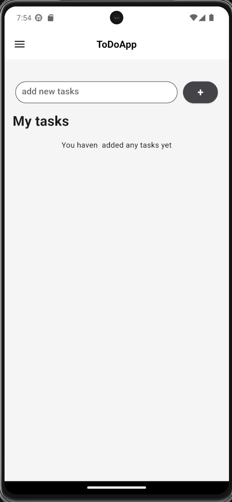
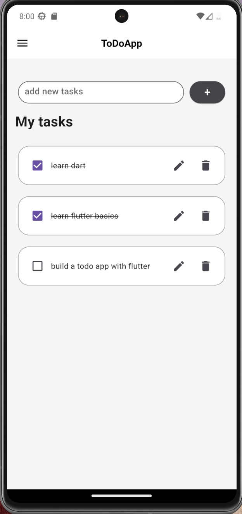

# flutter to-do app

## Project Overview
a simple todo list app using flutter. The app use's the provider library for state management.

## Features

* create tasks
* edit tasks
* delete tasks
* mark tasks as complete

## Screenshots

